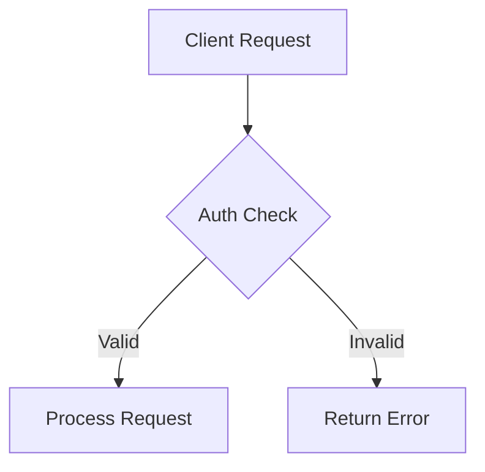

# Codebase Context Specification (CCS)

## Document Information
- **Version:** 1.1-RFC
- **Date:** 2024-12-06
- **Status:** Draft

## Table of Contents
1. [Overview](#overview)
2. [Key Principles](#key-principles)
3. [File Structure](#file-structure)
4. [Content Guidelines](#content-guidelines)
5. [AI Tool Interaction](#ai-tool-interaction)
6. [The .contextignore File](#the-contextignore-file)
7. [Additional Context Files](#additional-context-files)
8. [Modules and Submodules Hierarchy](#modules-and-submodules-hierarchy)
9. [Tool Support Guidance](#tool-support-guidance)
10. [Deprecations and Removals](#deprecations-and-removals)
11. [Conclusion](#conclusion)

## Overview

The Codebase Context Specification (CCS) establishes a unified, Markdown-based framework enabling AI developers and agentic tools to interpret codebases with enhanced clarity and context-awareness. This specification empowers agentic systems to operate with insight rather than guesswork by capturing architectural principles, design conventions, and domain logic in a structured, machine-consumable format.

### Key Advantages

1. **Enhanced Contextual Reasoning**  
   Agents leverage explicit architectural and design details to produce more targeted, relevant suggestions.

2. **Seamless Integration**  
   A human-readable yet machine-friendly Markdown format ensures both developers and tools can rapidly interpret and apply contextual information.

3. **Scalable Structure**  
   Hierarchical organization scales to complex codebases, enabling agents to maintain a coherent perspective as projects evolve.

## Key Principles

The CCS framework is built upon six foundational principles that guide how AI developers and agentic tools interpret, maintain, and evolve a codebase's contextual intelligence:

### 1. Markdown-Centricity
Rely on Markdown for primary documentation. Its universal readability ensures agents and developers alike can seamlessly parse and repurpose context.

### 2. Hierarchical Organization
Structure contextual data in logical tiers to reflect architectural depth. This hierarchy simplifies large-scale navigation and ensures agents easily grasp module-level and project-wide concepts.

### 3. Modularity and Extensibility
Adopt a modular approach, allowing independent components to maintain their own context directories. This enables agents to ingest relevant information selectively, reducing noise and complexity.

### 4. Clarity Over Complexity
Emphasize concise, meaningful documentation. Agents benefit from unambiguous architectural signals and well-defined conventions, ensuring more accurate guidance and fewer misinterpretations.

### 5. Agent-Friendly Linking
Employ wiki-style links and consistent naming schemes. Agents leverage these navigable references to build richer mental models of the codebase, accelerating their reasoning and minimizing guesswork.

### 6. Flexible Tool Integration
Design CCS to be tool-agnostic, supporting a variety of agentic solutions. Developers can adapt it to diverse environments, ensuring a broad range of AI-driven use cases is accommodated.

## File Structure

The CCS file structure centers around a dedicated `.context` directory at the project root, providing a single entry point while supporting hierarchical, module-level details.

### Core Structure
```
.context/
├── index.md           # Primary entry point with YAML front matter
├── docs.md           # Extended documentation and guides
├── diagrams/         # Architectural and workflow diagrams
└── images/          # Supporting visual assets
```

### Module Organization
```
project-root/
├── .context/         # Root context directory
└── module-name/
    └── .context/    # Module-specific context
```

### Key Components

#### Root Index File (`.context/index.md`)
- Serves as the primary entry point
- Contains high-level metadata in YAML front matter
- Defines local and remote modules
- Links to respective `.context` directories or external sources

#### Module Directories
Each locally defined module maintains its own `.context` directory (e.g., `auth-service/.context/`), including an `index.md` that mirrors the top-level structure.

#### Remote Modules
For modules referenced in the main front matter that reside in external repositories, agents follow provided URLs to integrate external context seamlessly.

## Content Guidelines

### YAML Front Matter

Each `index.md` file begins with essential metadata in YAML front matter:

```yaml
---
module-name: "authentication-service"
description: "Handles user authentication and session management"
technologies:
  - "Node.js"
  - "JWT"
  - "Redis"
related-modules:
  - "user-service"
  - "authorization-service"
permissions: "read-only"
version: "1.0.0"
---
```

### Markdown Body Structure

The main content should follow a clear, hierarchical structure:

#### 1. Module Overview
Provide a concise introduction to the module's purpose and responsibilities.

#### 2. Architecture
Detail the module's internal structure, components, and interactions.

#### 3. Domain Logic
Explain core business rules and domain-specific concepts.

#### 4. Integration Points
Document how the module interacts with other components.

#### 5. Configuration
Detail environment variables, configuration files, and setup requirements.

### Visual Documentation

Incorporate diagrams using Mermaid syntax for workflows and architecture:



## AI Tool Interaction

### Context Detection Process

1. **Initial Discovery**
   - Locate `.context` directory at project root
   - Parse `index.md` and `docs.md`
   - Build conceptual model from metadata

2. **Permission Management**
   - Check `permissions` field in front matter
   - Respect read/write access controls
   - Apply governance rules for context modifications

3. **Context Utilization**
   - Filter content using `.contextignore`
   - Focus on architecturally relevant files
   - Leverage diagrams and cross-references

### Evolution Strategy

As AI capabilities advance, tools can:
- Highlight inconsistencies
- Suggest reorganizations
- Propose module integration
- Maintain versioned context baseline

## The .contextignore File

### Purpose
The `.contextignore` file provides dedicated control over which content tools and agents consider when forming their context view.

### Key Features

#### Context-Driven Exclusion
Separates context filtering from source control concerns, focusing on architectural relevance.

#### Syntax
Supports familiar glob patterns:

```
# Build outputs
dist/
build/

# Dependencies
node_modules/

# Test artifacts
**/__snapshots__/
*.test.js.snap

# Temporary files
*.tmp
*.log
```

## Additional Context Files

### Core Documentation

#### 1. index.md
- Project architectural overview
- Key metadata
- Module references

#### 2. docs.md
- Extended explanations
- Tutorials
- Domain-specific guidance

### Visual Assets

Store diagrams and images in dedicated directories:
- `diagrams/`: Architectural and workflow visualization
- `images/`: Supporting graphics and screenshots

## Modules and Submodules Hierarchy

### Organization Structure

#### Local Modules
```
project/
├── .context/
│   └── index.md
├── service-a/
│   └── .context/
│       └── index.md
└── service-b/
    └── .context/
        └── index.md
```

#### Cross-Repository Integration
- Define relationships in root `.context/index.md`
- Maintain valid remote references
- Enable seamless navigation across boundaries

## Tool Support Guidance

### Implementation Strategy

#### 1. Metadata Utilization
- Parse YAML front matter
- Apply configuration settings
- Adapt analysis based on context

#### 2. Permission Management
- Respect write access controls
- Implement confirmation workflows
- Enable progressive AI autonomy

#### 3. Module Verification
- Validate local and remote references
- Maintain link integrity
- Update cross-references

#### 4. Visualization Support
- Generate architecture diagrams
- Provide navigation interfaces
- Enable context exploration

## Deprecations and Removals

### Version 1.1 Changes

- Removed: JSON/YAML `.context` formats
- Replaced: Single `.context.md` file with `.context` directory
- Updated: Parser requirements for new structure

## Conclusion

The Codebase Context Specification provides a robust framework for AI-driven development tools. Its structured approach to documentation and context management enables more precise, informed code analysis and development assistance. By adopting CCS, teams can create a more efficient, understanding-rich development environment that leverages AI capabilities to their fullest potential.